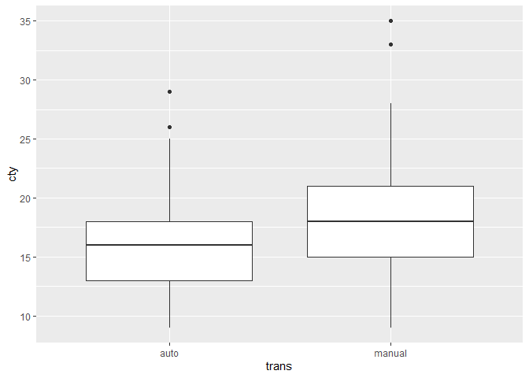
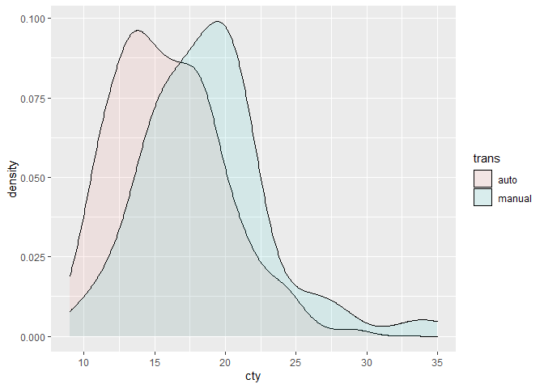
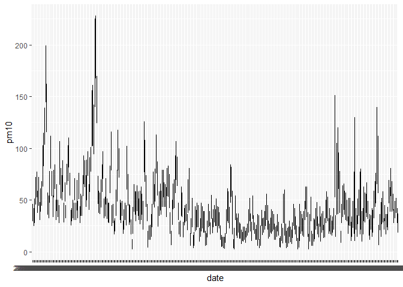
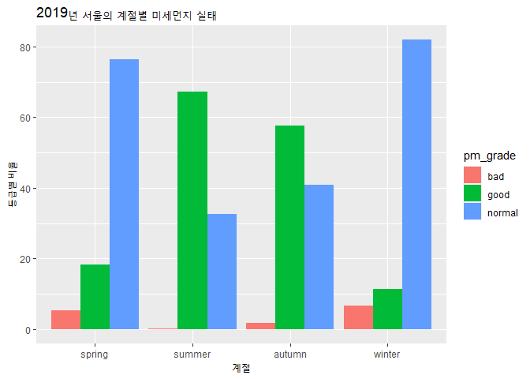

## 통계
 - 기술통계 : 평균, 최솟값, 최댓값, 중간값
 - 추론통계 : 변수간의 관계를 파악/ 새로운 사실을 추정(=발견)
              
              + 평균 차이 검정
                - 수치 데이터
                - 가설 검정 : 각 그룹간의 평균값의 차이를 검정
                - 남자의 평균 키와 여자의 키는 차이가 있을 것이다.
                
              + 교차 분석 (= 빈도분석)
                - 범주 데이터
                - 가설 검정 : 각 범주별 빈도를 활용해서 관계성을 검정
                
              + 상관 관계 분석 
                - 수치 데이터  
                - 상향될 경우 양의 상관관계, 하향될 경우 음의 상관관계
                - 두 변수간의 상관관계가 있느냐 없느냐?
                
              + 단순 회귀 분석
                - y = ax + b
                - 온도, 판매량
                - 가설 검정
                  + 기온(독립변수)가 판매량(종속변수)에 긍적적인영향을 
                    주고 있을 것이다.
### 통계 검정
 - 가설
 - Hypothesis
 ---> 공부 방법 : 선행 연구, 해당 분석방법의 가설설정 예시 존재
  - 연구 : 내가 궁금한 것을 찾아내는 것 (ex) 남자와 여자의 키가 동일
  
  - 귀무가설 : 두 그룹 간의 평균 차이가 없다.
  - 대립가설 : 두 그룹 간의 평균 차이가 있다.
  
  - 가설검정에서 인정하는 유의 수준
    + 5%, 1%, 0.1% 또는 10%
    
  - 오차범위 내에 있다. 
    - 여론 조사 A 후보 44%, B 후보 42% 시 누가 우세하다 할 수 없음.
    - 오차범위 내에 있을 시정확한 결과를 가져올 수 없음.
  - 오차범위 밖에 있다.
    - 조사의 결과가 확실함.
  
  - 자 평균 키, 여자 평균 키 실험  
    - 유의 수준 > 0.05 
  
### 두 집단의 평균 차이 검정

```r
mpg1 <- read.csv("data/mpg1.csv", stringsAsFactors = F)

t.test(data=mpg1, cty~trans) #t.test(mpg1$cty~mpg1$trans)와 같음
```

```
## 
## 	Welch Two Sample t-test
## 
## data:  cty by trans
## t = -4.5375, df = 132.32, p-value = 1.263e-05
## alternative hypothesis: true difference in means between group auto and group manual is not equal to 0
## 95 percent confidence interval:
##  -3.887311 -1.527033
## sample estimates:
##   mean in group auto mean in group manual 
##             15.96815             18.67532
```
  - t.test
    - 어떻게 데이터를 입력하는지 확인
    - p-value, 유의수준 0.05 이상 : 귀무가설, 0.05 이내 :대립가설
  
  - 시각화

```r
library(ggplot2)
ggplot(mpg1, aes(x=trans, y=cty)) + geom_boxplot() 
```

<!-- -->
    - 시각화로 명확하게 결과를 나타내기가 어려움 - t.test 검정 필요
  
  - t.test 검정
    + 귀무가설 : auto 와 manual의 cty 평균은 차이가 없다.
    + 대립가설 : auto 와 manual의 cty 평균은 차이가 있다.


```r
t.test(data =mpg1, cty ~ trans)
```

```
## 
## 	Welch Two Sample t-test
## 
## data:  cty by trans
## t = -4.5375, df = 132.32, p-value = 1.263e-05
## alternative hypothesis: true difference in means between group auto and group manual is not equal to 0
## 95 percent confidence interval:
##  -3.887311 -1.527033
## sample estimates:
##   mean in group auto mean in group manual 
##             15.96815             18.67532
```

```r
# 종속변수 ~ 독립변수
# 반응변수 ~ 설명변수
# y          x
```

 ### 두 그룹의 평균 차이 검정
   + 사전 필수 검증
   + 등분산 검정
     + 두 그룹간의 분산이 비슷하면 --> t.test (모수 검정)
     + 두 그룹간의 분산이 다르면 --> 비모수 검정
   + 등분산 검정
     + 귀무가설 : 두 그룹간ㅇ의 분산이 비슷하다.
      - p.value > 0.05
     + 대립가설 : 두 그룹간의 분산이 다르다.
     

```r
var.test(data = mpg1, cty~trans)
```

```
## 
## 	F test to compare two variances
## 
## data:  cty by trans
## F = 0.73539, num df = 156, denom df = 76, p-value = 0.1101
## alternative hypothesis: true ratio of variances is not equal to 1
## 95 percent confidence interval:
##  0.4912917 1.0719468
## sample estimates:
## ratio of variances 
##          0.7353887
```
     

```r
ggplot(mpg1, aes(x=cty, fill=trans)) + #geom_histogram()
  geom_density(alpha = 0.1)
```

<!-- -->
 ### 교차 분석 => 개발자도 알 필요가 있음.
    - 범주형 변수들이 관계가 있다는 것을 검정
    - 비율에 차이가 있는지 검정
    - 교차분석 검정은 R의 chisq.test() 함수로 진행
    - 귀무가설 : trans에 따라 drv(4, f,r)의 (비율) 차이가 없다.
    - 대립가설 : trans에 따라 drv 차이가 있다.
    - 빈도표 / 비율

```r
table(mpg1$trans, mpg1$drv) #교차분석
```

```
##         
##           4  f  r
##   auto   75 65 17
##   manual 28 41  8
```
    

```r
prop.table(table(mpg1$trans,mpg1$drv), 1)
```

```
##         
##                  4         f         r
##   auto   0.4777070 0.4140127 0.1082803
##   manual 0.3636364 0.5324675 0.1038961
```

 - auto 4륜 구동 (4) 인 47.8%
 - manual 전륜구동(f) 53.2% 가장 많음
 - 실제로 통계적으로 봤을 때, 차이가 있는지 검정
 
 - 귀무가설 : trans에 따라 drv(4, f,r)의 (비율) 차이가 없다.
 - 대립가설 : trans에 따라 drv 차이가 있다.
 

```r
chisq.test(mpg1$trans, mpg1$drv)
```

```
## 
## 	Pearson's Chi-squared test
## 
## data:  mpg1$trans and mpg1$drv
## X-squared = 3.1368, df = 2, p-value = 0.2084
```

## 실습

 - 패키지 설치 및 데이터 불러오기

```r
# install.packages("dplyr")
# install.packages("ggplot2")
library(dplyr)
```

```
## 
## 다음의 패키지를 부착합니다: 'dplyr'
```

```
## The following objects are masked from 'package:stats':
## 
##     filter, lag
```

```
## The following objects are masked from 'package:base':
## 
##     intersect, setdiff, setequal, union
```

```r
library(ggplot2)
```

```r
# install.packages("readxl")
library(readxl)
seoulair <-read_excel("data/서울대기오염_2019.xlsx")

str(seoulair)
```

```
## tibble [9,491 × 8] (S3: tbl_df/tbl/data.frame)
##  $ 날짜                   : chr [1:9491] "전체" "2019-12-31" "2019-12-31" "2019-12-31" ...
##  $ 측정소명               : chr [1:9491] "평균" "평균" "강남구" "강동구" ...
##  $ 미세먼지               : num [1:9491] 42 26 22 27 31 29 36 22 25 23 ...
##  $ 초미세먼지             : num [1:9491] 25 15 14 19 17 16 18 10 16 18 ...
##  $ 오존                   : num [1:9491] 0.025 0.022 0.025 0.019 0.022 0.022 0.026 0.019 0.022 0.019 ...
##  $ 이산화질소
## NO2 (ppm): num [1:9491] 0.028 0.016 0.014 0.02 0.022 0.017 0.013 0.016 0.02 0.019 ...
##  $ 일산화탄소
## CO (ppm) : num [1:9491] 0.5 0.4 0.4 0.4 0.4 0.4 0.4 0.4 0.3 0.4 ...
##  $ 아황산가스
## SO2(ppm) : num [1:9491] 0.004 0.003 0.003 0.003 0.002 0.004 0.003 0.002 0.004 0.003 ...
```
- 분석 변수 추출, 변수이름 변경

```r
seoulair <- seoulair %>%
  rename(date = "날짜",
         district ="측정소명",
         pm10="미세먼지",
         pm2.5="초미세먼지") %>% 
  select(date, district, pm10, pm2.5)
```

 - 변수의 결측치 이상치 확인하고 처리하기
   - 문자형 변수

```r
table(seoulair$date) # 빈도분석으로 date변수의 이상치 확인
```

```
## 
## 2019-01-01 2019-01-02 2019-01-03 2019-01-04 2019-01-05 2019-01-06 2019-01-07 
##         26         26         26         26         26         26         26 
## 2019-01-08 2019-01-09 2019-01-10 2019-01-11 2019-01-12 2019-01-13 2019-01-14 
##         26         26         26         26         26         26         26 
## 2019-01-15 2019-01-16 2019-01-17 2019-01-18 2019-01-19 2019-01-20 2019-01-21 
##         26         26         26         26         26         26         26 
## 2019-01-22 2019-01-23 2019-01-24 2019-01-25 2019-01-26 2019-01-27 2019-01-28 
##         26         26         26         26         26         26         26 
## 2019-01-29 2019-01-30 2019-01-31 2019-02-01 2019-02-02 2019-02-03 2019-02-04 
##         26         26         26         26         26         26         26 
## 2019-02-05 2019-02-06 2019-02-07 2019-02-08 2019-02-09 2019-02-10 2019-02-11 
##         26         26         26         26         26         26         26 
## 2019-02-12 2019-02-13 2019-02-14 2019-02-15 2019-02-16 2019-02-17 2019-02-18 
##         26         26         26         26         26         26         26 
## 2019-02-19 2019-02-20 2019-02-21 2019-02-22 2019-02-23 2019-02-24 2019-02-25 
##         26         26         26         26         26         26         26 
## 2019-02-26 2019-02-27 2019-02-28 2019-03-01 2019-03-02 2019-03-03 2019-03-04 
##         26         26         26         26         26         26         26 
## 2019-03-05 2019-03-06 2019-03-07 2019-03-08 2019-03-09 2019-03-10 2019-03-11 
##         26         26         26         26         26         26         26 
## 2019-03-12 2019-03-13 2019-03-14 2019-03-15 2019-03-16 2019-03-17 2019-03-18 
##         26         26         26         26         26         26         26 
## 2019-03-19 2019-03-20 2019-03-21 2019-03-22 2019-03-23 2019-03-24 2019-03-25 
##         26         26         26         26         26         26         26 
## 2019-03-26 2019-03-27 2019-03-28 2019-03-29 2019-03-30 2019-03-31 2019-04-01 
##         26         26         26         26         26         26         26 
## 2019-04-02 2019-04-03 2019-04-04 2019-04-05 2019-04-06 2019-04-07 2019-04-08 
##         26         26         26         26         26         26         26 
## 2019-04-09 2019-04-10 2019-04-11 2019-04-12 2019-04-13 2019-04-14 2019-04-15 
##         26         26         26         26         26         26         26 
## 2019-04-16 2019-04-17 2019-04-18 2019-04-19 2019-04-20 2019-04-21 2019-04-22 
##         26         26         26         26         26         26         26 
## 2019-04-23 2019-04-24 2019-04-25 2019-04-26 2019-04-27 2019-04-28 2019-04-29 
##         26         26         26         26         26         26         26 
## 2019-04-30 2019-05-01 2019-05-02 2019-05-03 2019-05-04 2019-05-05 2019-05-06 
##         26         26         26         26         26         26         26 
## 2019-05-07 2019-05-08 2019-05-09 2019-05-10 2019-05-11 2019-05-12 2019-05-13 
##         26         26         26         26         26         26         26 
## 2019-05-14 2019-05-15 2019-05-16 2019-05-17 2019-05-18 2019-05-19 2019-05-20 
##         26         26         26         26         26         26         26 
## 2019-05-21 2019-05-22 2019-05-23 2019-05-24 2019-05-25 2019-05-26 2019-05-27 
##         26         26         26         26         26         26         26 
## 2019-05-28 2019-05-29 2019-05-30 2019-05-31 2019-06-01 2019-06-02 2019-06-03 
##         26         26         26         26         26         26         26 
## 2019-06-04 2019-06-05 2019-06-06 2019-06-07 2019-06-08 2019-06-09 2019-06-10 
##         26         26         26         26         26         26         26 
## 2019-06-11 2019-06-12 2019-06-13 2019-06-14 2019-06-15 2019-06-16 2019-06-17 
##         26         26         26         26         26         26         26 
## 2019-06-18 2019-06-19 2019-06-20 2019-06-21 2019-06-22 2019-06-23 2019-06-24 
##         26         26         26         26         26         26         26 
## 2019-06-25 2019-06-26 2019-06-27 2019-06-28 2019-06-29 2019-06-30 2019-07-01 
##         26         26         26         26         26         26         26 
## 2019-07-02 2019-07-03 2019-07-04 2019-07-05 2019-07-06 2019-07-07 2019-07-08 
##         26         26         26         26         26         26         26 
## 2019-07-09 2019-07-10 2019-07-11 2019-07-12 2019-07-13 2019-07-14 2019-07-15 
##         26         26         26         26         26         26         26 
## 2019-07-16 2019-07-17 2019-07-18 2019-07-19 2019-07-20 2019-07-21 2019-07-22 
##         26         26         26         26         26         26         26 
## 2019-07-23 2019-07-24 2019-07-25 2019-07-26 2019-07-27 2019-07-28 2019-07-29 
##         26         26         26         26         26         26         26 
## 2019-07-30 2019-07-31 2019-08-01 2019-08-02 2019-08-03 2019-08-04 2019-08-05 
##         26         26         26         26         26         26         26 
## 2019-08-06 2019-08-07 2019-08-08 2019-08-09 2019-08-10 2019-08-11 2019-08-12 
##         26         26         26         26         26         26         26 
## 2019-08-13 2019-08-14 2019-08-15 2019-08-16 2019-08-17 2019-08-18 2019-08-19 
##         26         26         26         26         26         26         26 
## 2019-08-20 2019-08-21 2019-08-22 2019-08-23 2019-08-24 2019-08-25 2019-08-26 
##         26         26         26         26         26         26         26 
## 2019-08-27 2019-08-28 2019-08-29 2019-08-30 2019-08-31 2019-09-01 2019-09-02 
##         26         26         26         26         26         26         26 
## 2019-09-03 2019-09-04 2019-09-05 2019-09-06 2019-09-07 2019-09-08 2019-09-09 
##         26         26         26         26         26         26         26 
## 2019-09-10 2019-09-11 2019-09-12 2019-09-13 2019-09-14 2019-09-15 2019-09-16 
##         26         26         26         26         26         26         26 
## 2019-09-17 2019-09-18 2019-09-19 2019-09-20 2019-09-21 2019-09-22 2019-09-23 
##         26         26         26         26         26         26         26 
## 2019-09-24 2019-09-25 2019-09-26 2019-09-27 2019-09-28 2019-09-29 2019-09-30 
##         26         26         26         26         26         26         26 
## 2019-10-01 2019-10-02 2019-10-03 2019-10-04 2019-10-05 2019-10-06 2019-10-07 
##         26         26         26         26         26         26         26 
## 2019-10-08 2019-10-09 2019-10-10 2019-10-11 2019-10-12 2019-10-13 2019-10-14 
##         26         26         26         26         26         26         26 
## 2019-10-15 2019-10-16 2019-10-17 2019-10-18 2019-10-19 2019-10-20 2019-10-21 
##         26         26         26         26         26         26         26 
## 2019-10-22 2019-10-23 2019-10-24 2019-10-25 2019-10-26 2019-10-27 2019-10-28 
##         26         26         26         26         26         26         26 
## 2019-10-29 2019-10-30 2019-10-31 2019-11-01 2019-11-02 2019-11-03 2019-11-04 
##         26         26         26         26         26         26         26 
## 2019-11-05 2019-11-06 2019-11-07 2019-11-08 2019-11-09 2019-11-10 2019-11-11 
##         26         26         26         26         26         26         26 
## 2019-11-12 2019-11-13 2019-11-14 2019-11-15 2019-11-16 2019-11-17 2019-11-18 
##         26         26         26         26         26         26         26 
## 2019-11-19 2019-11-20 2019-11-21 2019-11-22 2019-11-23 2019-11-24 2019-11-25 
##         26         26         26         26         26         26         26 
## 2019-11-26 2019-11-27 2019-11-28 2019-11-29 2019-11-30 2019-12-01 2019-12-02 
##         26         26         26         26         26         26         26 
## 2019-12-03 2019-12-04 2019-12-05 2019-12-06 2019-12-07 2019-12-08 2019-12-09 
##         26         26         26         26         26         26         26 
## 2019-12-10 2019-12-11 2019-12-12 2019-12-13 2019-12-14 2019-12-15 2019-12-16 
##         26         26         26         26         26         26         26 
## 2019-12-17 2019-12-18 2019-12-19 2019-12-20 2019-12-21 2019-12-22 2019-12-23 
##         26         26         26         26         26         26         26 
## 2019-12-24 2019-12-25 2019-12-26 2019-12-27 2019-12-28 2019-12-29 2019-12-30 
##         26         26         26         26         26         26         26 
## 2019-12-31       전체 
##         26          1
```

```r
table(seoulair$district)# 빈도분석으로 district 변수의 이상치 확인
```

```
## 
##   강남구   강동구   강북구   강서구   관악구   광진구   구로구   금천구 
##      365      365      365      365      365      365      365      365 
##   노원구   도봉구 동대문구   동작구   마포구 서대문구   서초구   성동구 
##      365      365      365      365      365      365      365      365 
##   성북구   송파구   양천구 영등포구   용산구   은평구   종로구     중구 
##      365      365      365      365      365      365      365      365 
##   중랑구     평균 
##      365      366
```

```r
# seoulair에서date가 '전체'가 아니고, district가 '평균'이 아닌 데이터만 추출
seoulair <- seoulair %>% filter(date!="전체"&district!="평균")
```
   - 실수형 변수

```r
summary(seoulair$pm10)
```

```
##    Min. 1st Qu.  Median    Mean 3rd Qu.    Max.    NA's 
##    3.00   24.00   36.00   41.76   52.00  228.00     213
```

```r
summary(seoulair$pm2.5)
```

```
##    Min. 1st Qu.  Median    Mean 3rd Qu.    Max.    NA's 
##    1.00   14.00   21.00   24.93   30.00  153.00     203
```
 - 파생 변수 만들기
   - month, day 만들기

```r
# month 변수 만들기, 6번째 데이터 시작,7번째 데이터 끝
seoulair$month <- substr(seoulair$date, 6, 7) 
# day 변수 만들기, 9번째 데이터 시작, 10번째 데이터 끝
seoulair$day <- substr(seoulair$date, 9, 10)

class(seoulair$month)# 변수 유형 확인
```

```
## [1] "character"
```

```r
class(seoulair$day)
```

```
## [1] "character"
```

```r
seoulair$month <-as.numeric(seoulair$month) # 변수를 숫자형으로 변환
seoulair$day <- as.numeric(seoulair$day)
```
    - season 변수 만들기

```r
class(seoulair$month)
```

```
## [1] "numeric"
```

```r
seoulair$season <- ifelse(seoulair$month%in%c("3","4","5"), "spring",
                        ifelse(seoulair$month%in%c("6","7","8"), "summer",
                         ifelse(seoulair$month%in%c("9","10","11"),"autumn","winter")))
# 3,4,5,6,7,8,9,10,11을 캐릭터로 인지
```
    - 분석데이터 최종 확인

```r
str(seoulair)
```

```
## tibble [9,125 × 7] (S3: tbl_df/tbl/data.frame)
##  $ date    : chr [1:9125] "2019-12-31" "2019-12-31" "2019-12-31" "2019-12-31" ...
##  $ district: chr [1:9125] "강남구" "강동구" "강북구" "강서구" ...
##  $ pm10    : num [1:9125] 22 27 31 29 36 22 25 23 22 19 ...
##  $ pm2.5   : num [1:9125] 14 19 17 16 18 10 16 18 17 12 ...
##  $ month   : num [1:9125] 12 12 12 12 12 12 12 12 12 12 ...
##  $ day     : num [1:9125] 31 31 31 31 31 31 31 31 31 31 ...
##  $ season  : chr [1:9125] "winter" "winter" "winter" "winter" ...
```
 - 데이터 분석
    - 연간 미세먼지 평균 알아보기

```r
mean(seoulair$pm10, na.rm = T) # 미세먼지 평균 알아보기기
```

```
## [1] 41.76167
```
    - 미세먼지가 가장 심했던 날짜 알아보기

```r
seoulair %>% 
  filter(!is.na(pm10)) %>% # 결측치 없는 자료 추출
  filter(pm10==max(pm10)) %>% # pm10 최댓값행 추출
  select(date,district,pm10) # 3개 변수만 출력력
```

```
## # A tibble: 1 × 3
##   date       district  pm10
##   <chr>      <chr>    <dbl>
## 1 2019-03-05 강북구     228
```
     - 구별 미세먼지 평균비교

```r
seoulair %>%
  filter(!is.na(pm10)) %>% # 결측치가 아닌 행만 추출
  group_by(district) %>% # 구를 기준으로 데이터 분류
  summarise(m=mean(pm10)) %>% # 구별로 pm10 평균구하기
  arrange(m) %>%  # 평균 기준으로 오름차순 정렬
  head(5) # 상위 5개행 출력력
```

```
## # A tibble: 5 × 2
##   district     m
##   <chr>    <dbl>
## 1 용산구    34.1
## 2 중랑구    37.3
## 3 중구      37.6
## 4 종로구    37.7
## 5 도봉구    38.0
```
     - 계절별 분석

```r
seoulair %>% 
  filter(!is.na(pm10)&!is.na(pm2.5)) %>%  # 두개의 시간대의 결측치 동시 제거
  group_by(season) %>% # season 변수로 데이터 분류
  summarise(m1=mean(pm10),   # 평균구하기
            m2=mean(pm2.5)) %>%
              arrange(m1) # pm10 평균을 기준으로 오름차순 정렬
```

```
## # A tibble: 4 × 3
##   season    m1    m2
##   <chr>  <dbl> <dbl>
## 1 summer  26.3  18.1
## 2 autumn  31.1  15.7
## 3 spring  54.1  31.6
## 4 winter  54.7  33.7
```
     - 미세먼지 등급 분석

```r
seoulair %>% 
  filter(!is.na(pm10)) %>%
  mutate(pm_grade=ifelse(pm10<=30, "good", # pm 변수 만들기
                         ifelse(pm10<=81, "normal",
                        ifelse(pm10<=150, "bad", "worse")))) %>%
  group_by(pm_grade) %>% # 변수를 기준으로 분류
  summarise(n=n()) %>% # 등급별 빈도 구하기
  mutate(total=sum(n), # 변수의 빈도 총계구하기
         pct=round(n/total*100,1)) %>%  # 백분율을 소수점 한자리까지 구하기
  select(pm_grade,n,pct) %>% #출력변수 지정
  arrange(desc(n))#빈도 기준으로 내림차순 정렬
```

```
## # A tibble: 4 × 3
##   pm_grade     n   pct
##   <chr>    <int> <dbl>
## 1 normal    4842  54.3
## 2 good      3412  38.3
## 3 bad        577   6.5
## 4 worse       81   0.9
```
     -구별 미ㅔ먼지 등급 비교

```r
seoulair %>% 
  filter(!is.na(pm10)) %>% 
  mutate(pm_grade=ifelse(pm10<=30, "good",
                         ifelse(pm10 <= "81", "normal",
                                ifelse(pm10 <= 150, "bad", "worse")))) %>% 
  
  group_by(district,pm_grade) %>%# district별로 pm_grade 등급 분류
  summarise(n=n()) %>% # 등급별 빈도 구하기
  mutate(total=sum(n), # 변수의 빈도 총계구하기
         pct=round(n/total*100,1)) %>%  # 백분율을 소수점 한자리까지 구하기
  filter(pm_grade=="good") %>% #good 등급 데이터 추출
  select(district,n,pct) %>% # 3개변수만 추출
  arrange(desc(pct)) %>% #백분율
  head(5)
```

```
## `summarise()` has grouped output by 'district'. You can override using the
## `.groups` argument.
```

```
## # A tibble: 5 × 3
## # Groups:   district [5]
##   district     n   pct
##   <chr>    <int> <dbl>
## 1 용산구     196  54  
## 2 중구       169  46.3
## 3 중랑구     151  46.2
## 4 종로구     163  44.7
## 5 금천구     161  44.4
```
    - 1년 간 미세먼지 추이를 그래프로 그리기

```r
ggplot(data=seoulair,aes(x=date,y=pm10))+geom_line()
```

```
## Warning: Removed 48 row(s) containing missing values (geom_path).
```

<!-- -->
    - 계절별 미세먼지 등급 비율 그래프 그리기
    

```r
season_grade <- seoulair %>% 
 filter(!is.na(pm10)) %>% 
 mutate(pm_grade=ifelse(pm10<=30, "good",
                         ifelse(pm10 <= "81", "normal",
                                ifelse(pm10 <= 150, "bad", "worse")))) %>% 
  group_by(season,pm_grade) %>%# district별로 pm_grade 등급 분류
  summarise(n=n()) %>% # 등급별 빈도 구하기
  mutate(total=sum(n), # 변수의 빈도 총계구하기
         pct=round(n/total*100,1)) %>%  # 백분율을 소수점 한자리까지 구하기
  select(season,pm_grade,pct)  # 3개변수만 추출
```

```
## `summarise()` has grouped output by 'season'. You can override using the
## `.groups` argument.
```

```r
ggplot(data=season_grade, aes(x=season, y=pct, fill=pm_grade)) +
   geom_col(position = "dodge") +
   scale_x_discrete(limits=c("spring","summer","autumn","winter")) +
   ggtitle("2019년 서울의 계절별 미세먼지 실태") +
   xlab("계절")+
   ylab("등급별 비율")
```

<!-- -->
     
  
  
  
